# Projet_P4
## Développez un programme logiciel en Python
### 1) Description de l'application
Ce projet consiste en une application python exécutable à la demande qui permet de :
* gérer des tournois d'échecs
* gérer des joueurs d'échecs
* générer des rapports relatifs aux tournois et aux joueurs :
    * Liste de tous les acteurs
    * Liste de tous les joueurs d'un tournoi
    * Liste de tous les tournois
    * Liste de tous les tours d'un tournoi
    * Liste de tous les matchs d'un tournoi

#### Architecture de l'application

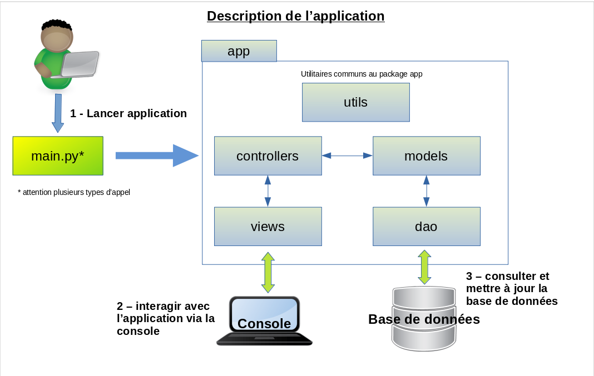

L'application se lance à partir du programme main.py situé à la racine du projet.

Le programme main.py attend en paramètres le nom du module à lancer :

* `python3 main.py -p joueur` : instancie un objet ControllerJoueur de gestion des joueurs d'échecs (module `app.controllers.controller_joueur`) et le lance via sa méthode `start()`

* `python3 main.py -p tournoi` : instancie un objet ControllerTournoi de gestion des tournois d'échecs (module `app.controllers.controller_tournoi`) et le lance via sa méthode `start()`

* `python3 main.py -p rapport` : instancie un objet ControllerRapport de génération et d'affichage des rapports (module `app.controllers.controller_rapport`) et l'exécute via sa méthode `start()`

L'application respecte le design pattern Modèle-Vue-Contrôleur (MVC)

* Le package `app.models` représente le Modèle. Il contient les modules :
  * exception : ensemble des exceptions dans l'application
  * joueur : définition de la classe Joueur
  * match : définition de la classe Match
  * tour : définition de la classe Tour
  * tournoi : définition de la classe Tournoi

* Le package `app.views` correspond à la partie Vue. Il contient les modules :
    * formulaire : différents formulaires de saisie de données appelés par les controllers
    * generic_views : vues génériques utilisées par les controllers controller_joueur et controller_tournoi
    * menu : menu générique affiché par un controller
    * rapport : différents rapports générés par le controller_rapport

* Le package `app.controllers` représente le Contrôleur. Il contient 3 contrôleurs (un par mode d'appel du programme principal  main.py) :
  * controller_joueur : affiche le menu de gestion des joueurs et exécute différentes actions en fonction des choix de l'utilisateur
  * controller_rapport : affiche le menu de gestion des rapports et exécute différentes actions en fonction des choix de l'utilisateur
  * controller_tournoi : affiche le menu de gestion des tournois et exécute différentes actions en fonction des choix de l'utilisateur

* Le packaqe `app.dao` est la couche d'accès aux données DAO (Data Acces Object).

* Le packaqe `app.utils` contient des utilitaires communs aux packages de l'application

Remarques :

Chaque contrôleur n'accède qu'à des objets de type Modele ou Vue.
Un contrôleur n'accède jamais directement à la base de données.

#### Diagramme de classes

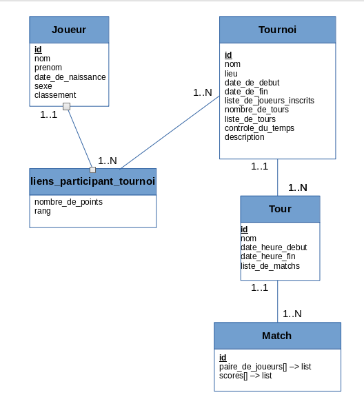

#### Modèle physique de données

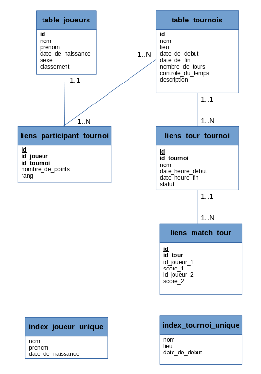

#### GitFlow du projet

Les branches du projet :

* Branche de développement `p4_dev` : développement du projet avec un découpage "façon Django" (models.py + views.py + controllers.py). Cette branche a rapidement été abandonnée.
* Branche de développement `p4_dev_packages` : développement du projet avec un découpage en packages
* Branche 'main' et 'master' : version finale

### 2) Installation du projet en local sur votre machine

Sur votre machine créer un dossier dans lequel vous allez installer le projet.
On nommera par exemple ce dossier `projects`. (vous pouvez le nommer autrement, c'est juste pour avoir une référence dans la suite des explications)

Aller sur le dépôt github : https://github.com/yannis971/Projet_P4

Pour l'installation, il y a 2 méthodes possibles.

#### 2.1) Première méthode : Téléchargement du fichier zip

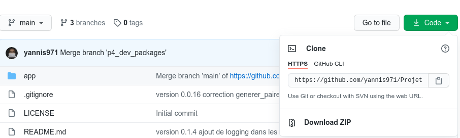

Dans l'onglet **<> Code** de la page ci-dessus, cliquer sur le bouton **Code** puis sur **Download ZIP**

Placer le fichier zip dans le dossier `projects` et le dézipper.

Ouvrir un terminal et se déplacer dans la racine du projet dossier '`projects/Projet_P4-main/`'

Passer à l'étape 3 pour configurer l'environnement virtuel

#### 2.2) Deuxième méthode : Clonage du dépôt avec git

Sur la figure précédente, copier le lien https : https://github.com/yannis971/Projet_P4.git

Ouvrir un terminal et se déplacer dans le dossier `projects` créé précédemment et taper la commande :

`git clone ` suivi du lien https copié plus haut.

soit : `git clone https://github.com/yannis971/Projet_P4.git`

Se déplacer dans la racine du projet dossier '`projects/Projet_P4`'

Cela donne quelque chose comme ci-dessous :

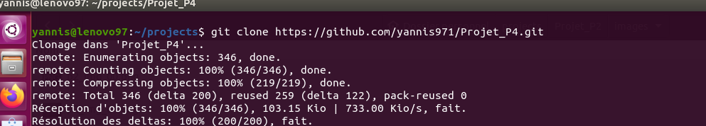

Passer à l'étape 3 pour configurer l'environnement virtuel

### 3) Configuration de l'environnement virtuel

#### Remarque

Les commandes ci-dessous (notamment celles concernant l'installation de pip pour python3) sont valables sur un système d'exploitation Linux de type Debian ou de ses dérivés.

Pour Windows, on utilise python et pip.

Pour Mac OS, on utilise python3 et pip3.

#### 3.1) Installer pip pour python3 si ce n'est pas déjà fait

Si la commande `pip3 --version` renvoie une erreur alors il convient d'installer pip

`sudo apt-get update && sudo apt-get install python3-pip`

Si l'installation a réussi, la commande vous renverra une ligne comme indiqué ci-dessous
`pip 20.2.3 from /home/yannis/.local/lib/python3.8/site-packages/pip (python 3.8)`

#### 3.2) Créer un environnement virtuel et l'activer

Se placer à la racine du projet (dossier dans lequel se trouve le fichier main.py) et lancer la commande :

`python3 -m venv env`

Une fois l'environnement virtuel  `env` créé, l'activer avec la commande :

`source env/bin/activate`

#### 3.4) Installer les dépendances du projet

Toujours à la racine du projet, lancer l'une des 2 commandes suivantes :

`pip3 install -r requirements.txt`

`python3 -m pip install -r requirements.txt`

### 4) Exécution

La commande `python3 main.py` affiche une brève description du programme et une aide.

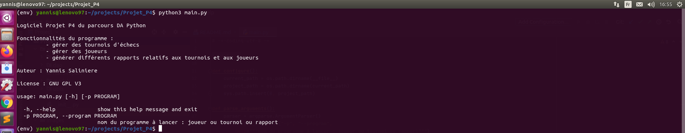

La commande `python3 main.py -h` affiche l'aide du programme main.py.

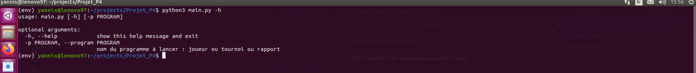

La commande `python3 main.py -p joueur` lance le programme de gestion des joueurs.

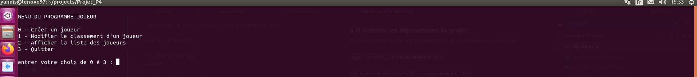

La commande `python3 main.py -p tournoi` lance le programme de gestion des tournois.

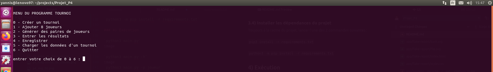

La commande `python3 main.py -p rapport` lance le programme d'édition des rapports.

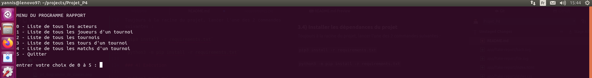

### 5) Rapport flake8-html

La commande pour générer les rapports flake8-html de vérification de conformité du code source
Attention se positionner dans le répertoire `projects/Projet_P4/app` pour ne pas scanner tout le code de l'environnement virtuel .

`flake8 --format=html --htmldir=flake-report`

Le résultat se trouve dans le dossier `flake-report` de `projects/Projet_P4`

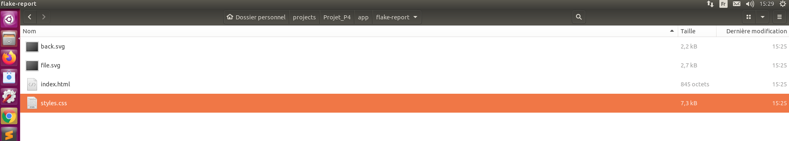

Il suffit alors d'ouvrir le fichier `index.html` dans votre navigateur Internet.

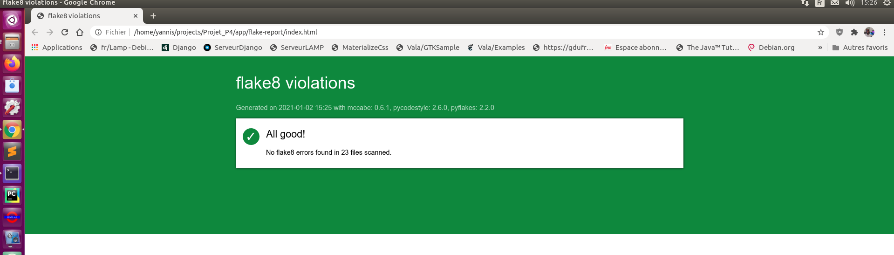

### 6) Licence

Pour ce projet, en plus de la bibliothèque standard `Python`, j'utilise les paquets `tinydb version 4.3.0`, `pandas version 1.2.0`, `flake8 version 3.8.4` et `flake8-html version 0.4.1` tous les 4 compatibles avec la licence **GPL**.

Par conséquent, je publie le code de ce projet sous licence libre **GNU GPL V3**

### 7) Questions/Aide/Support

En cas de problèmes ou pour questions relatives à ce projet, vous pouvez me contacter via l'un des canaux suivants :

* e-mail : yannis.saliniere@gmail.com

* twitter : https://twitter.com/YSaliniere

* rubrique "issues" du projet github : https://github.com/yannis971/Projet_P4/issues
